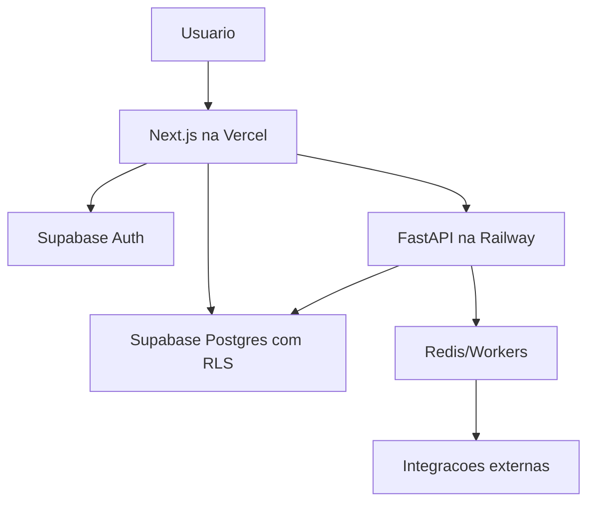

# Arquitetura

## Plataformas

- Vercel: frontend Next.js, rotas server-side leves e edge cache.
- Supabase: Postgres, Auth, Storage, Realtime e Row Level Security.
- Railway: API FastAPI, workers, jobs agendados, Redis e integracoes.

## Fluxo principal

## Responsabilidades

Frontend:

- Experiencia principal do usuario.
- Autenticacao via Supabase.
- Diario, dashboard, busca, progresso e configuracoes.

Supabase:

- Dados transacionais.
- Politicas RLS por usuario.
- Storage de imagens futuras.
- Realtime para sincronizacao.

Railway:

- Calculos de dominio que exigem backend confiavel.
- Importacao/moderacao de catalogo.
- Webhooks de pagamentos e integracoes.
- Tarefas assicronas e jobs.

